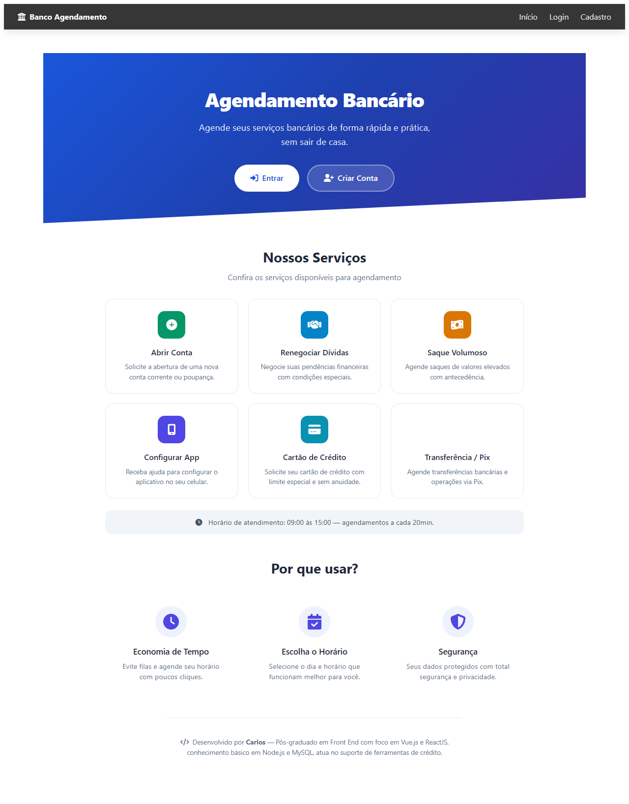
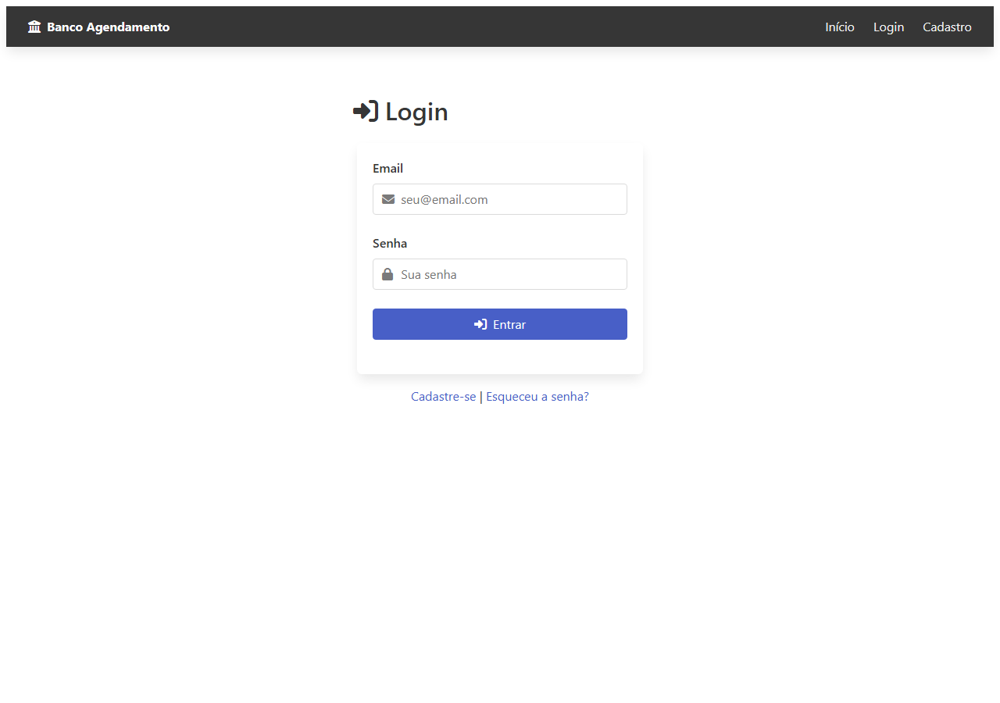
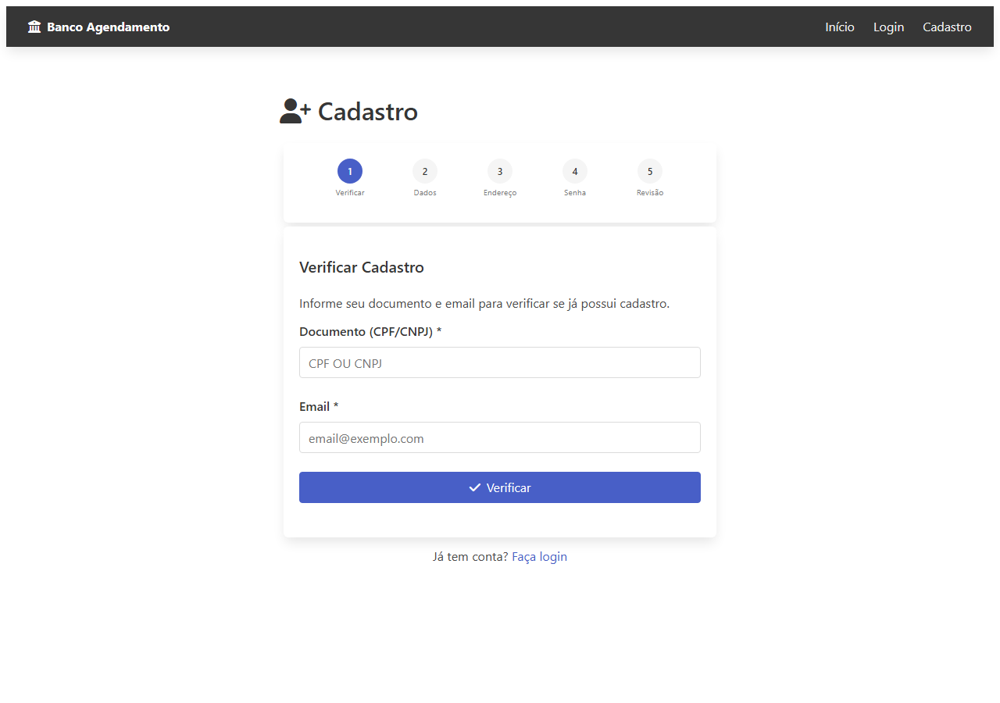
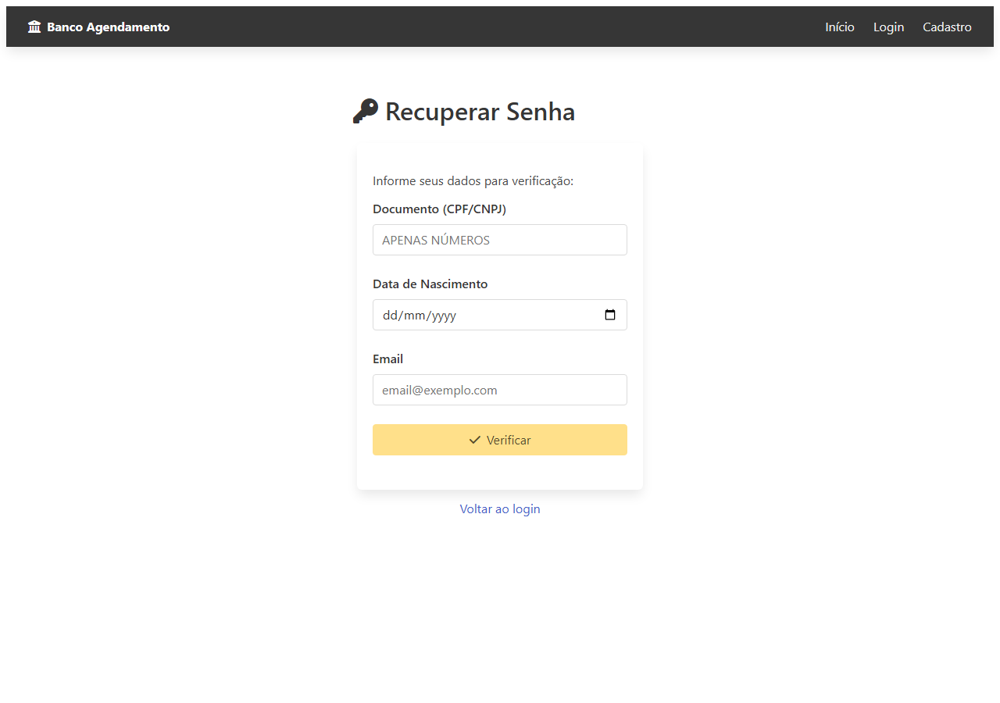
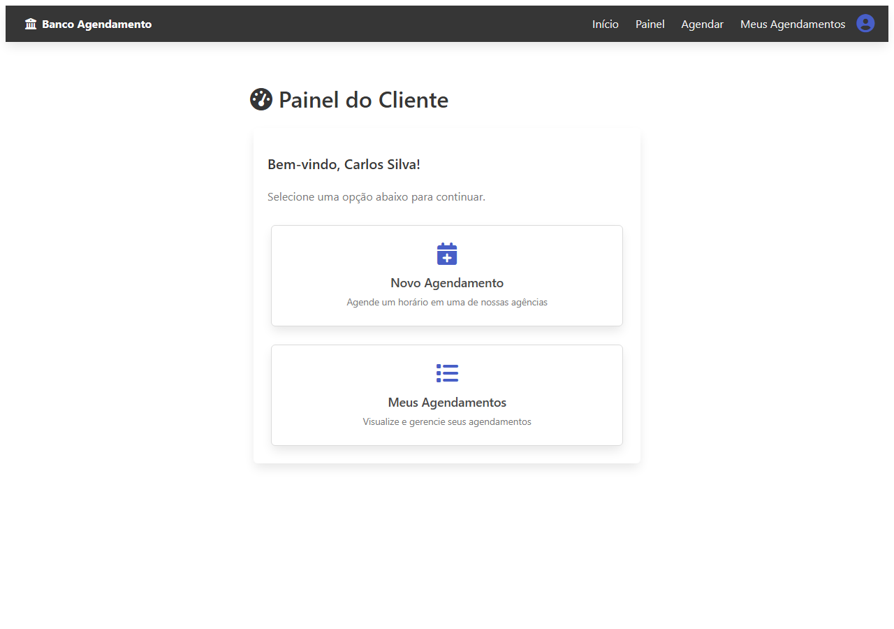
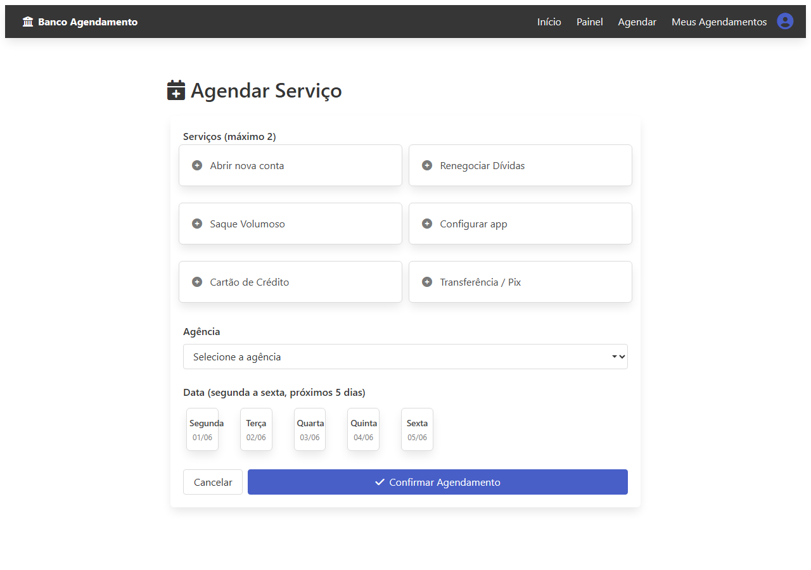
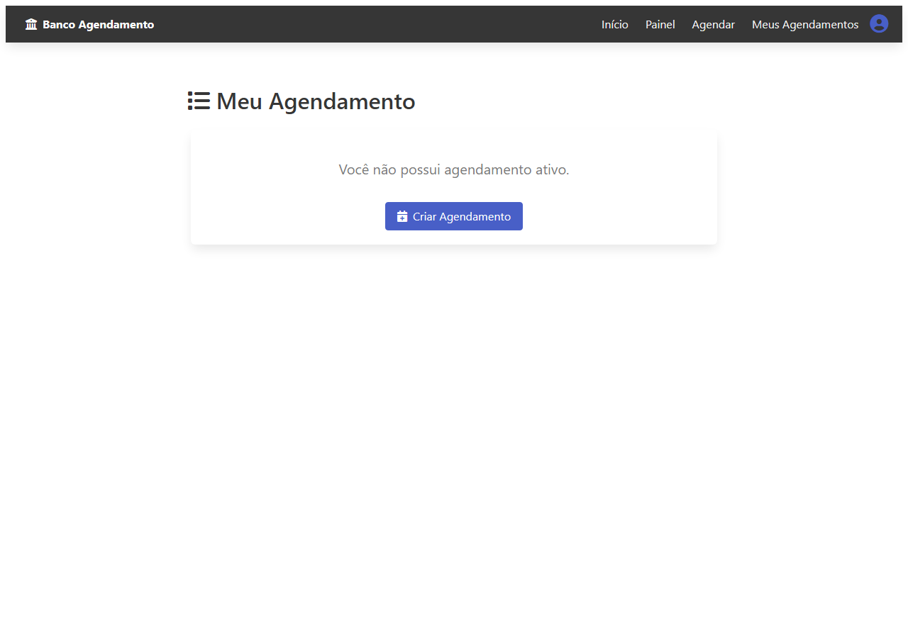
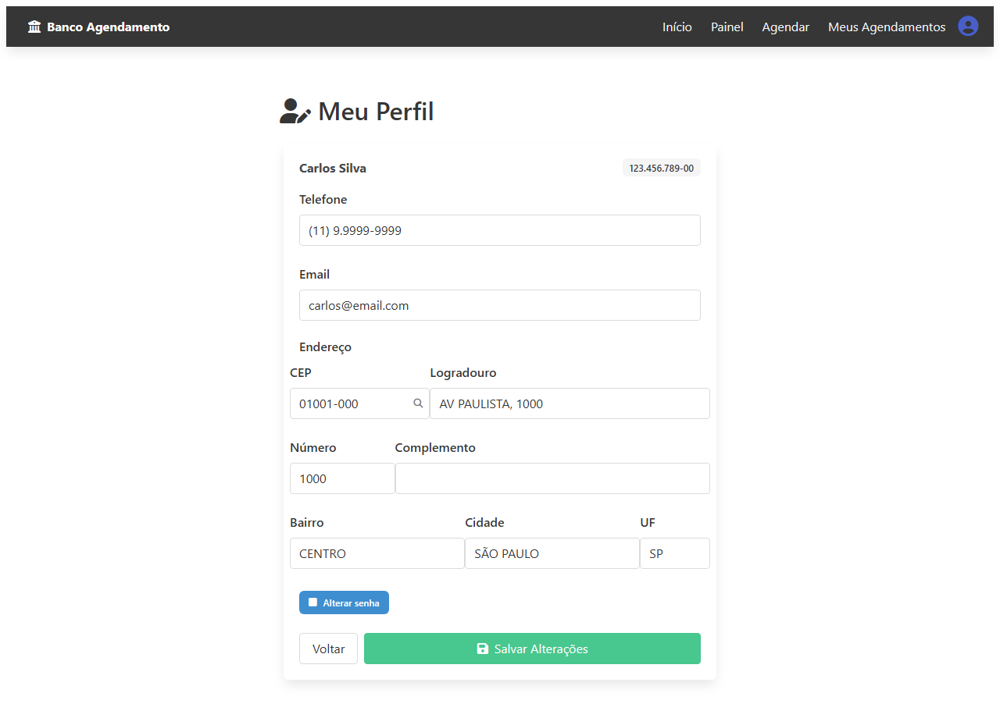
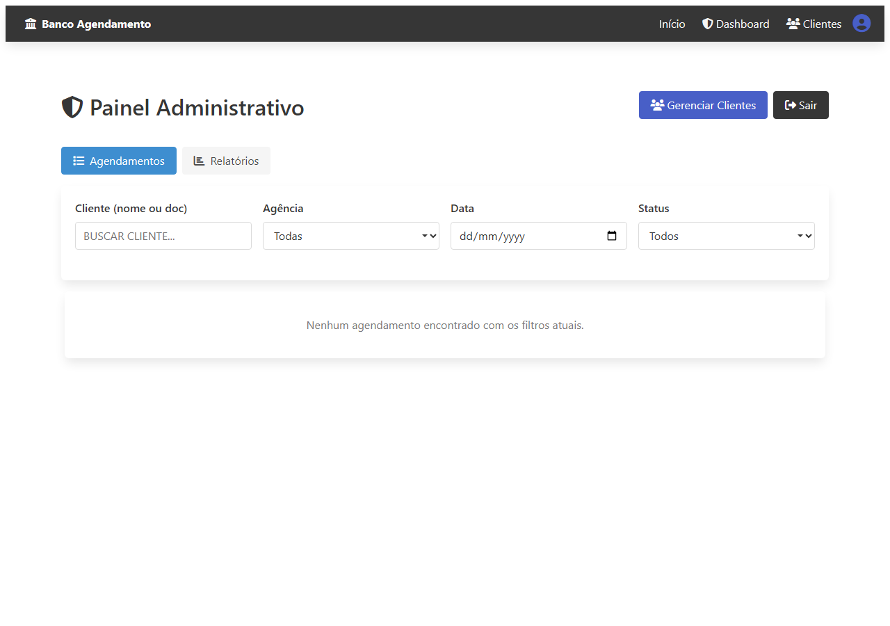
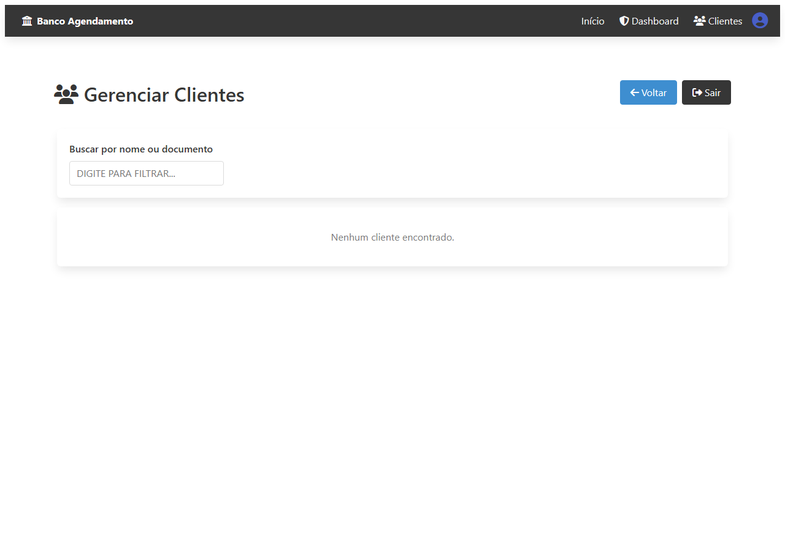

# Agendamento Bancário

Sistema de agendamento de serviços bancários com Vue 3 + TypeScript (frontend) e Node.js + Express + TiDB Cloud (backend), deploy no Vercel (frontend) e Render (backend).

## Funcionalidades

### Usuário
- **Cadastro** com verificação de documento/email, dados pessoais, endereço (via API ViaCEP), senha e revisão
- **Login** com email e senha (contas inativas são bloqueadas)
- **Recuperação de senha** usando documento + data de nascimento + email
- **Agendamento** com seleção de serviços (até 2), agência, data (calendário semanal) e horário (formato brasileiro)
- **Regra de 2 horas**: agendamentos só permitidos com no mínimo 2h de antecedência
- **Limite de 1 agendamento ativo**: apenas serviços pendentes ou confirmados bloqueiam novo agendamento
- **Editar e cancelar** agendamento ativo (status `pending` ou `confirmed`)
- **Histórico** dos últimos 5 atendimentos (concluídos/cancelados)
- **Painel do Cliente** com edição de perfil (telefone, email, endereço, senha)

### Administrador
- Usuários com email `@banco.com` são automaticamente administradores
- Login unificado pelo `/entrar`
- Painel com filtros por cliente, agência, data e status
- Ações: confirmar, concluir e cancelar agendamentos
- **Gerenciar Clientes**: listar, buscar, editar dados e ativar/desativar contas
- Paginação e exibição dos últimos 3 atendimentos por cliente

### Serviços disponíveis
- Abrir nova conta
- Renegociar Dívidas
- Saque Volumoso
- Configurar app
- Cartão de Crédito
- Transferência / Pix

### Horários
- 09h às 15h, agendamentos a cada 20 minutos
- Dias úteis (segunda a sexta) nos próximos 7 dias

### Agências
- Agência Central, Norte, Sul, Leste, Oeste

## Tecnologias

### Frontend
- **Vue 3** (Composition API + TypeScript)
- **Vue Router** com guards de autenticação
- **Pinia** para estado global
- **SCSS** com classes em português e design responsivo
- **Axios** para requisições HTTP
- **ViaCEP API** para busca de endereço

### Backend
- **Node.js** + **Express** + **TypeScript**
- **TiDB Cloud** (MySQL-compatível)
- **JWT** para autenticação
- **Swagger** para documentação da API

## Estrutura

```
agenda/
├── agenda-bancaria/    # Frontend Vue 3
│   ├── src/
│   │   ├── views/       # Páginas (Home, Login, Register, Dashboard, etc.)
│   │   ├── stores/      # Pinia stores (auth, appointments)
│   │   ├── router/      # Rotas com guards
│   │   ├── services/    # API e CEP
│   │   ├── types/       # Interfaces e constantes
│   │   └── styles/      # SCSS
│   ├── vercel.json      # Config Vercel
│   └── package.json
├── backend/             # API Express
│   ├── src/
│   │   ├── routes/      # auth, admin, appointments, profile
│   │   ├── middleware/   # JWT auth
│   │   └── ...
│   └── package.json
├── render.yaml          # Config Render
└── .gitignore
```

## Como Executar (local)

```bash
# Frontend
cd agenda-bancaria
npm install
npm run dev         # Vite em :5173

# Backend (requer TiDB Cloud)
cd backend
npm install
cp .env.example .env  # configurar credenciais
npm run migrate        # criar tabelas
npm run dev            # API em :3000
```

## Deploy

| Serviço | Plataforma | Link |
|---------|-----------|------|
| Frontend | Vercel | https://app-agenda-gamma.vercel.app |
| Backend  | Render  | https://app-agenda-9ov0.onrender.com |

```bash
# Frontend
cd agenda-bancaria
npm run build       # dist/
vercel --prod

# Backend
cd backend
npm run build
git push            # Render auto-deploy
```

## Regras de Negócio

- Máximo **1 agendamento ativo** por cliente (pending ou confirmed)
- Até **2 serviços** por agendamento
- Mínimo **2 horas de antecedência** para agendamento no mesmo dia
- Apenas dias úteis nos **próximos 7 dias**
- Administrador pode editar dados e ativar/desativar contas
- Usuário edita apenas telefone, email, endereço e senha
- Contas inativas não realizam login nem recuperam senha

## Screenshots

| Página | Captura |
|--------|---------|
| Home |  |
| Login |  |
| Cadastro |  |
| Recuperar Senha |  |
| Painel do Cliente |  |
| Agendar Serviço |  |
| Meus Agendamentos |  |
| Perfil |  |
| Painel Administrativo |  |
| Gerenciar Clientes |  |
